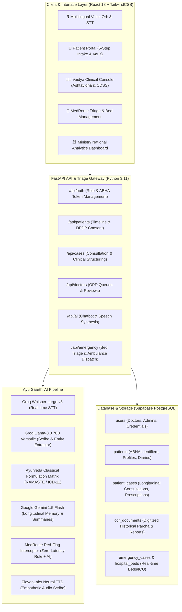
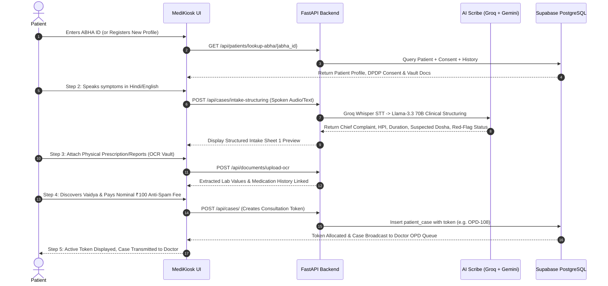
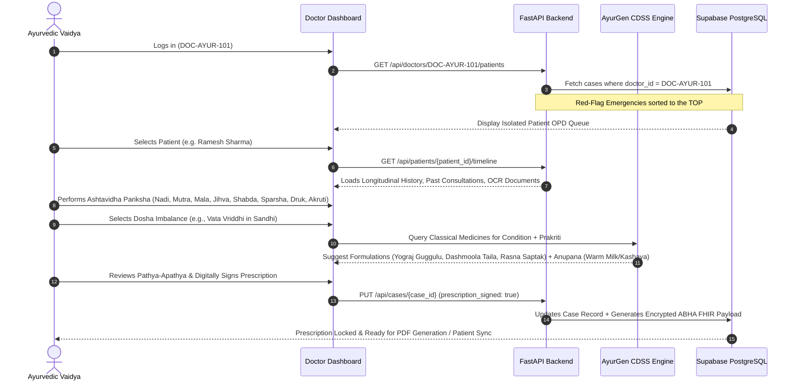

# 🌿 SWASTH SAARTHI / MEDIKIOSK (SIH26047)
## Comprehensive Technical System Architecture, Methodology & Clinical Workflow Documentation

---

## 1. Executive Summary & Core Idea

**SwasthSaarthi (MediKiosk)** is an Ayushman Bharat Digital Mission (ABDM) and Ministry of Ayush-compliant, AI-powered Smart Digital Health Kiosk and Clinical Decision Support System (CDSS). 

### Problem Statement:
Traditional Ayurvedic healthcare in India faces four primary bottlenecks:
1. **Unstructured & Vernacular Clinical Intakes**: Rural and elderly patients describe symptoms in colloquial regional Hindi/dialects, leading to communication gaps and loss of clinical nuances.
2. **Missing Longitudinal Health Records**: Patients carry fragmented physical papers (*parchaas*), lab reports, and radiology scans that get lost or damaged over time, breaking continuity of care.
3. **Absence of Real-time Emergency Triage in Ayush OPDs**: Critical red-flag medical emergencies (e.g., myocardial infarction, acute cerebrovascular events, acute dyspnea) are occasionally misdiagnosed as routine *vata/pitta* imbalances in non-integrated OPDs.
4. **Lack of Dual Taxonomy Discovery**: Patients struggle to find certified Ayurvedic Vaidyas based on specific colloquial symptoms or classical Ayurvedic specializations (*Kayachikitsa*, *Shalya Tantra*, *Panchakarma*).

### The SwasthSaarthi Solution:
A bi-directional digital bridge featuring:
- **Zero-Touch Voice AI Intake**: Groq Whisper STT + LLM clinical structuring in native vernacular.
- **ABDM-Compliant Central Identity**: 14-digit ABHA ID integration with DPDP Act 2023 cryptographic consent.
- **Ashtavidha Pariksha & AyurGen Clinical Engine**: Standardized 8-fold Ayurvedic diagnostic matrix mapped to classical formulations (*Yograj Guggulu*, *Mahasudarshan Ghanvati*, *Mahatiktaka Ghrita*, etc.) with strict *Anupana* and *Pathya-Apathya*.
- **MedRoute Red-Flag Triage Engine**: Sub-second emergency interceptor with automated hospital bed/ICU alerting.
- **Multimodal OCR Document Vault**: Digitization and automated entity extraction from historical physical prescriptions.

---

## 2. End-to-End System Architecture

---

## 3. Core Methodologies & Clinical Workflows

### 3.1 Patient Journey: The 5-Step Smart Intake Wizard

---

### 3.2 Doctor Journey: Vaidya Clinical Console & CDSS

---

## 4. Key Architectural Pillars

### 4.1 Strict Multi-Tenant Data Isolation
- **Patient Isolation**: Every patient session queries strictly via their verified `abha_id` or internal `patient_id`. Patients have access only to their own consultations, symptom logs, and OCR vault documents.
- **Doctor Queue Isolation**: The endpoint `GET /api/doctors/{doctor_id}/patients` queries `patient_cases` where `doctor_id == current_doctor.id`. Unrelated doctors cannot view other clinics' OPD queues.
- **DPDP Act 2023 Compliance**: Cryptographic consent timestamps are maintained with revocable data sharing boundaries. Private doctor notes (`private_notes`) remain strictly confidential to the authoring doctor.

---

### 4.2 Ashtavidha Pariksha Standardized Diagnostic Matrix
Ayurvedic diagnosis requires an objective 8-fold clinical examination:

| Pariksha (Fold) | Clinical Modality | Diagnostic Indicators Captured in SwasthSaarthi |
| :--- | :--- | :--- |
| **1. Nadi (Pulse)** | Radial Palpation | *Vata (Sarpa/Snake)*, *Pitta (Manduka/Frog)*, *Kapha (Hansa/Swan)*, Rate, Rhythm, Volume |
| **2. Mutra (Urine)** | Urological Inspection | Color (Pale/Yellow/Dark), Turbidity, Sensation (Burning/Normal), Frequency |
| **3. Mala (Stool)** | Gastrointestinal Assay | Consistency (Hard/Loose/Semi-solid), Floating status (*Sama* vs *Nirama*), Frequency |
| **4. Jihva (Tongue)** | Oral Examination | Coating (*Lipta/Saam*), Color, Tremors, Dryness, Papillae prominence |
| **5. Shabda (Voice/Speech)** | Acoustic Triage | Voice clarity, Hoarseness, Weakness, Cough resonance |
| **6. Sparsha (Touch/Skin)** | Tactile Assessment | Skin Temperature (Sheeta/Ushna), Dryness (Ruksha), Moisture (Snigdha), Texture |
| **7. Druk (Eyes/Vision)** | Ophthalmic Assessment | Sclera Color (Haridra/Pitta, Shweta/Kapha, Rakta), Clarity, Photophobia |
| **8. Akruti (Body Build)** | Morphological Analysis | Body constitution (Sthula/Krisha/Madhyama), Posture, Gait, Joint deformities |

---

### 4.3 MedRoute Red-Flag Interceptor & Emergency Protocol
1. **Zero-Latency Regex + Semantic Analysis**:
   - Real-time scanning for triggers: *Severe chest pain*, *heart attack*, *chhati me dard*, *saans phoolna*, *loss of consciousness*, *slurred speech*, *blood vomiting*.
2. **Dynamic Queue Priority Bypassing**:
   - Red-flag cases bypass standard routine token queues, receiving top-of-list emergency status with glowing visual alerts.
3. **Automated Bed & ICU Allocation**:
   - Direct integration with hospital admin dashboard (`/medroute-triage`), tracking ICU, Oxygen, and General bed availability across connected facilities.

---

### 4.4 Multimodal OCR Document Vault
- Physical prescriptions and lab reports uploaded by patients or scanned via kiosk hardware are processed through OCR entity extractors.
- Key medical parameters (e.g., *HbA1c*, *Serum Creatinine*, *Lipid Profile*, *X-Ray findings*) are extracted into structured JSON metadata and appended to the patient's central longitudinal record.

---

## 5. Technology Stack Summary

- **Frontend**: React 18 (Vite), TailwindCSS, Lucide Icons, Modern Glassmorphism UI.
- **Backend API**: FastAPI (Python 3.11), SQLAlchemy ORM, Pydantic v2.
- **Database**: PostgreSQL on Supabase (Scalable Cloud Instance with Connection Pooling).
- **AI & Speech Engine**:
  - **Groq Whisper Large v3**: Real-time Vernacular Speech-to-Text.
  - **Groq Llama-3.3 70B Versatile**: Clinical Structuring, Entity Extraction & Prescription Generation.
  - **Google Gemini 1.5 Flash**: Multi-visit Longitudinal Memory & Patient Summaries.
  - **ElevenLabs**: Empathetic Multilingual Voice Audio Feedback.
- **Security & Standards**: ABDM FHIR Standards, DPDP Act 2023, SHA-256 Checksums, TLS Encryption.

---

## 6. Repository & Live Deployment

- **GitHub Repository**: [https://github.com/devanshd07o/swasth_sarthi.git](https://github.com/devanshd07o/swasth_sarthi.git)
- **Local Development Server**: `http://localhost:3000/`
- **Backend API Docs**: `http://localhost:8000/docs`
